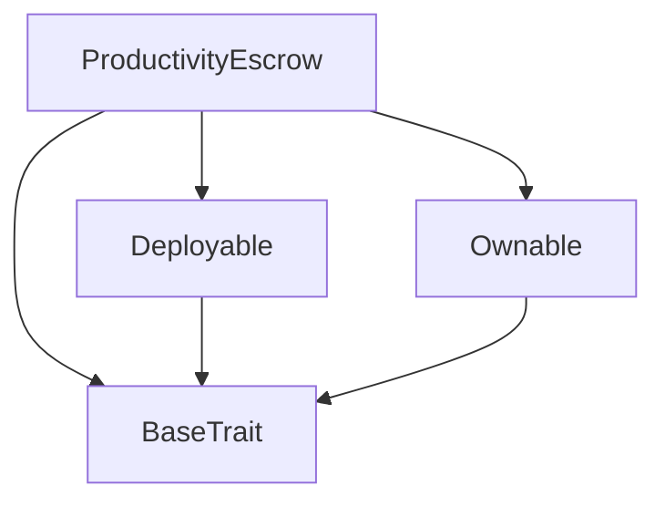

# Tact compilation report
Contract: ProductivityEscrow
BoC Size: 2284 bytes

## Structures (Structs and Messages)
Total structures: 21

### DataSize
TL-B: `_ cells:int257 bits:int257 refs:int257 = DataSize`
Signature: `DataSize{cells:int257,bits:int257,refs:int257}`

### SignedBundle
TL-B: `_ signature:fixed_bytes64 signedData:remainder<slice> = SignedBundle`
Signature: `SignedBundle{signature:fixed_bytes64,signedData:remainder<slice>}`

### StateInit
TL-B: `_ code:^cell data:^cell = StateInit`
Signature: `StateInit{code:^cell,data:^cell}`

### Context
TL-B: `_ bounceable:bool sender:address value:int257 raw:^slice = Context`
Signature: `Context{bounceable:bool,sender:address,value:int257,raw:^slice}`

### SendParameters
TL-B: `_ mode:int257 body:Maybe ^cell code:Maybe ^cell data:Maybe ^cell value:int257 to:address bounce:bool = SendParameters`
Signature: `SendParameters{mode:int257,body:Maybe ^cell,code:Maybe ^cell,data:Maybe ^cell,value:int257,to:address,bounce:bool}`

### MessageParameters
TL-B: `_ mode:int257 body:Maybe ^cell value:int257 to:address bounce:bool = MessageParameters`
Signature: `MessageParameters{mode:int257,body:Maybe ^cell,value:int257,to:address,bounce:bool}`

### DeployParameters
TL-B: `_ mode:int257 body:Maybe ^cell value:int257 bounce:bool init:StateInit{code:^cell,data:^cell} = DeployParameters`
Signature: `DeployParameters{mode:int257,body:Maybe ^cell,value:int257,bounce:bool,init:StateInit{code:^cell,data:^cell}}`

### StdAddress
TL-B: `_ workchain:int8 address:uint256 = StdAddress`
Signature: `StdAddress{workchain:int8,address:uint256}`

### VarAddress
TL-B: `_ workchain:int32 address:^slice = VarAddress`
Signature: `VarAddress{workchain:int32,address:^slice}`

### BasechainAddress
TL-B: `_ hash:Maybe int257 = BasechainAddress`
Signature: `BasechainAddress{hash:Maybe int257}`

### Deploy
TL-B: `deploy#946a98b6 queryId:uint64 = Deploy`
Signature: `Deploy{queryId:uint64}`

### DeployOk
TL-B: `deploy_ok#aff90f57 queryId:uint64 = DeployOk`
Signature: `DeployOk{queryId:uint64}`

### FactoryDeploy
TL-B: `factory_deploy#6d0ff13b queryId:uint64 cashback:address = FactoryDeploy`
Signature: `FactoryDeploy{queryId:uint64,cashback:address}`

### ChangeOwner
TL-B: `change_owner#819dbe99 queryId:uint64 newOwner:address = ChangeOwner`
Signature: `ChangeOwner{queryId:uint64,newOwner:address}`

### ChangeOwnerOk
TL-B: `change_owner_ok#327b2b4a queryId:uint64 newOwner:address = ChangeOwnerOk`
Signature: `ChangeOwnerOk{queryId:uint64,newOwner:address}`

### CreateChallenge
TL-B: `create_challenge#c2860504 beneficiary:address challengeId:^string totalCheckpoints:uint32 endDate:uint64 unlisted:bool = CreateChallenge`
Signature: `CreateChallenge{beneficiary:address,challengeId:^string,totalCheckpoints:uint32,endDate:uint64,unlisted:bool}`

### AddFunds
TL-B: `add_funds#48402acd challengeIdx:uint32 = AddFunds`
Signature: `AddFunds{challengeIdx:uint32}`

### ClaimCheckpoint
TL-B: `claim_checkpoint#7b562c3f challengeIdx:uint32 checkpointIndex:uint32 signature:^slice = ClaimCheckpoint`
Signature: `ClaimCheckpoint{challengeIdx:uint32,checkpointIndex:uint32,signature:^slice}`

### RefundUnclaimed
TL-B: `refund_unclaimed#70ccaed4 challengeIdx:uint32 = RefundUnclaimed`
Signature: `RefundUnclaimed{challengeIdx:uint32}`

### ChallengeData
TL-B: `_ sponsor:address beneficiary:address challengeId:^string totalDeposit:coins totalCheckpoints:uint32 amountPerCheckpoint:coins claimedCount:uint32 endDate:uint64 createdAt:uint64 active:bool unlisted:bool = ChallengeData`
Signature: `ChallengeData{sponsor:address,beneficiary:address,challengeId:^string,totalDeposit:coins,totalCheckpoints:uint32,amountPerCheckpoint:coins,claimedCount:uint32,endDate:uint64,createdAt:uint64,active:bool,unlisted:bool}`

### ProductivityEscrow$Data
TL-B: `_ owner:address verifierPublicKey:uint256 challengeCount:uint32 challenges:dict<int, ^ChallengeData{sponsor:address,beneficiary:address,challengeId:^string,totalDeposit:coins,totalCheckpoints:uint32,amountPerCheckpoint:coins,claimedCount:uint32,endDate:uint64,createdAt:uint64,active:bool,unlisted:bool}> claimedCheckpoints:dict<int, bool> sponsorContributions:dict<int, int> feeWalletA:address feeWalletB:address = ProductivityEscrow`
Signature: `ProductivityEscrow{owner:address,verifierPublicKey:uint256,challengeCount:uint32,challenges:dict<int, ^ChallengeData{sponsor:address,beneficiary:address,challengeId:^string,totalDeposit:coins,totalCheckpoints:uint32,amountPerCheckpoint:coins,claimedCount:uint32,endDate:uint64,createdAt:uint64,active:bool,unlisted:bool}>,claimedCheckpoints:dict<int, bool>,sponsorContributions:dict<int, int>,feeWalletA:address,feeWalletB:address}`

## Get methods
Total get methods: 6

## challengeCount
No arguments

## challenge
Argument: idx

## isCheckpointClaimed
Argument: challengeIdx
Argument: checkpointIdx

## sponsorContribution
Argument: challengeIdx
Argument: sponsor

## verifierPublicKey
No arguments

## owner
No arguments

## Exit codes
* 2: Stack underflow
* 3: Stack overflow
* 4: Integer overflow
* 5: Integer out of expected range
* 6: Invalid opcode
* 7: Type check error
* 8: Cell overflow
* 9: Cell underflow
* 10: Dictionary error
* 11: 'Unknown' error
* 12: Fatal error
* 13: Out of gas error
* 14: Virtualization error
* 32: Action list is invalid
* 33: Action list is too long
* 34: Action is invalid or not supported
* 35: Invalid source address in outbound message
* 36: Invalid destination address in outbound message
* 37: Not enough Toncoin
* 38: Not enough extra currencies
* 39: Outbound message does not fit into a cell after rewriting
* 40: Cannot process a message
* 41: Library reference is null
* 42: Library change action error
* 43: Exceeded maximum number of cells in the library or the maximum depth of the Merkle tree
* 50: Account state size exceeded limits
* 128: Null reference exception
* 129: Invalid serialization prefix
* 130: Invalid incoming message
* 131: Constraints error
* 132: Access denied
* 133: Contract stopped
* 134: Invalid argument
* 135: Code of a contract was not found
* 136: Invalid standard address
* 138: Not a basechain address
* 1619: End date must be in the future
* 2253: Deposit too small for checkpoint count
* 8346: Challenge not found
* 8433: Challenge is not active
* 12222: Challenge has not ended yet
* 17701: Only sponsor can refund
* 27888: Insufficient deposit. Must send TON to fund the challenge.
* 28546: Must have at least 1 checkpoint
* 43091: Invalid checkpoint index
* 48401: Invalid signature
* 55597: Only beneficiary can claim
* 57829: Checkpoint already claimed
* 61368: Challenge has expired
* 62291: Challenge already closed
* 62674: Must send more than 0.01 TON

## Trait inheritance diagram

## Contract dependency diagram

